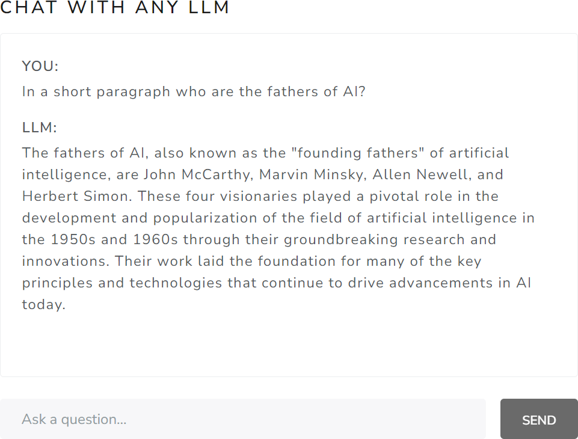
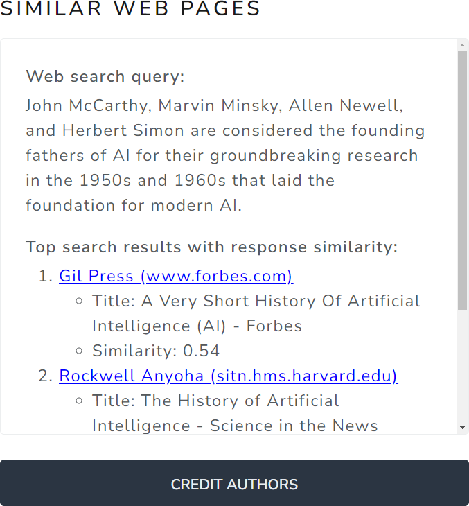
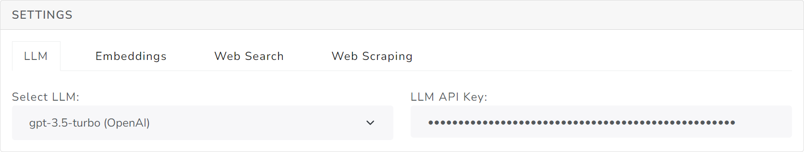

# Medoid AI - 🤲 GiveBackGPT

<h4 align="center">An initiative to build a fair and sustainable AI ecosystem by identifying and crediting open-access creators whose work shows strong similarity to AI-generated content.</h4>

<p align="center">
  <a href="https://github.com/medoidai/givebackgpt/blob/main/LICENSE" target="_blank"></a>
  <a href="https://github.com/medoidai/givebackgpt/fork" target="_blank"></a>
  <a href="https://github.com/medoidai/givebackgpt/stargazers" target="_blank"></a>
  <a href="https://github.com/medoidai/givebackgpt/issues" target="_blank"></a>
  <a href="https://github.com/medoidai/givebackgpt/pulls" target="_blank"></a>
</p>

<p align="center">
  <a href="https://github.com/medoidai/givebackgpt/issues/new/choose" target="_blank">Report Bug</a>
  ·
  <a href="https://github.com/medoidai/givebackgpt/issues/new/choose" target="_blank">Request Feature</a>
  ·
  <a href="https://www.linkedin.com/showcase/givebackgpt/" target="_blank">Follow Us</a>
</p>

## 📜 Table of Contents

- [Medoid AI - 🤲 GiveBackGPT](#medoid-ai----givebackgpt)
  - [📜 Table of Contents](#-table-of-contents)
  - [📚 Overview](#-overview)
  - [✨ Features Overview](#-features-overview)
  - [🛠️ Technology Stack](#️-technology-stack)
  - [💻 How to setup the development environment?](#-how-to-setup-the-development-environment)
    - [📥 Clone the project's repository](#-clone-the-projects-repository)
    - [📄 Copy the environment template file to .env file](#-copy-the-environment-template-file-to-env-file)
    - [⚙️ Set the environment variables in .env file](#️-set-the-environment-variables-in-env-file)
    - [🔍 Check the environment variables](#-check-the-environment-variables)
    - [▶️ Start the development environment](#️-start-the-development-environment)
  - [🚀 How to deploy the application?](#-how-to-deploy-the-application)
    - [📥 Clone the project's repository](#-clone-the-projects-repository-1)
    - [📄 Copy the environment template file to .env file](#-copy-the-environment-template-file-to-env-file-1)
    - [⚙️ Set the environment variables in .env file](#️-set-the-environment-variables-in-env-file-1)
    - [🔍 Check the environment variables](#-check-the-environment-variables-1)
    - [🏗️ Build the docker image](#️-build-the-docker-image)
    - [🐳 Run the docker container](#-run-the-docker-container)
  - [🎯 How do I use the application?](#-how-do-i-use-the-application)
    - [▶️ Access the application](#️-access-the-application)
    - [🎉 Trying out the features](#-trying-out-the-features)
  - [🌟 Contributions](#-contributions)
  - [🌱 What's Next](#-whats-next)
  - [🙏 Community Support](#-community-support)
  - [📄 License](#-license)

## 📚 Overview

<p align="center">
  
</p>

**GiveBackGPT** is an initiative dedicated to creating a **fair and sustainable AI** ecosystem. This novel process orchestrates the automatic identification and crediting of **open-access content creators**, whose work is essential in training generative AI models and keeping them relatable.

By leveraging standard web search to find and credit content similar to AI-generated responses, GiveBackGPT aims to recognize and reward creators in a simple, platform-agnostic, and streamlined way. Placing creator crediting at the inference level aligns with the value extraction point, removing barriers for small AI teams to innovate and discouraging monopoly data licensing deals.

Our vision includes establishing a licensing framework where **GenAI vendors** pay for legal data access, supporting a more equitable AI economy. Additionally, an open fund governed democratically will provide monetary rewards to creators who register and grant AI usage rights.

Follow us for updates on our progress towards a comprehensive standalone solution and join us in supporting a **democratized AI future**.

## ✨ Features Overview

| Feature                        | Description                                                                                          |
|--------------------------------|------------------------------------------------------------------------------------------------------|
| Chat Interface                 | Enables users to interact with an LLM for text-based conversations                                   |
| Web Search                     | Searches the web and presents top-related web pages based on its responses                           |
| Integration with External APIs | Provides capabilities for LLM responses, text embedding, web scraping, and web search                |
| API Keys Storage Location      | Ensures storage of API keys exclusively within the user's local web browser                          |
| GiveBackGPT Leaderboard        | Allows submission of top-related web pages to the GiveBackGPT leaderboard to credit original authors |
| Configuration Settings         | Offers tabs for managing and setting API keys for external services                                  |
| Responsive Design              | Utilizes Bootstrap framework for ensuring responsiveness across various devices                      |
| Hugging Face Authentication    | Supports user login via Hugging Face OAuth for secure and seamless authentication                    |
| Flexible Rate Limiting         | Applies rate limiting by IP for public endpoints and by Hugging Face user ID for authenticated ones  |

## 🛠️ Technology Stack

* **HTML**: For structuring the content of the web application.
* **CSS**: For styling the application to ensure it is visually appealing and user-friendly.
* **JavaScript**: For adding interactivity and dynamic behavior to the application.
* **Bootstrap**: For a responsive and mobile-first design using pre-defined components and utilities.
* **Docker**: To ensure consistent and reliable deployment across different environments.
* **FastAPI**: Handles backend logic, API routing, and serves frontend static content efficiently.
* **Redis**: Used as a fast, in-memory data store to support rate limiting by keeping track of request counts.

## 💻 How to setup the development environment?

* Make sure you have [VS Code](https://code.visualstudio.com/), [Dev Containers extension](https://marketplace.visualstudio.com/items?itemName=ms-vscode-remote.remote-containers), [Docker](https://www.docker.com/) and [Git](https://git-scm.com/) installed.

* Kindly ensure that all subsequent commands are executed using `Bash` shell for compatibility and optimal functionality.

### 📥 Clone the project's repository

```sh
git clone git@github.com:medoidai/givebackgpt.git && cd givebackgpt
```

### 📄 Copy the environment template file to .env file

```sh
cp -f .env.template .env
```

### ⚙️ Set the environment variables in .env file

Open the .env file and set the environment variables inside to their correct values and save the file.

### 🔍 Check the environment variables

```sh
cat .env
```

### ▶️ Start the development environment

To start the development environment:

* Run **Dev Containers: Open Folder in Container...** from the Command Palette (**F1**) and select the *givebackgpt* folder.

* VS Code will then:
  * start up the container
  * connect the window to the container
  * and install all necessary extensions for debugging

## 🚀 How to deploy the application?

* Make sure you have [Docker](https://www.docker.com/) and [Git](https://git-scm.com/) installed.

* Kindly ensure that all subsequent commands are executed using `Bash` shell for compatibility and optimal functionality.

### 📥 Clone the project's repository

```sh
git clone git@github.com:medoidai/givebackgpt.git && cd givebackgpt
```

### 📄 Copy the environment template file to .env file

```sh
cp -f .env.template .env
```

### ⚙️ Set the environment variables in .env file

Open the .env file and set the environment variables inside to their correct values and save the file.

### 🔍 Check the environment variables

```sh
cat .env
```

### 🏗️ Build the docker image

```sh
docker build --platform linux/amd64 -t "givebackgpt:latest" .
```

### 🐳 Run the docker container

```sh
docker run -d -p "7860:7860" --env-file .env --restart unless-stopped --name "givebackgpt" "givebackgpt:latest"
```

## 🎯 How do I use the application?

### ▶️ Access the application

* If you are running the application locally, open it at: http://localhost:7860
* Alternatively, you can try the application online via the <a href="https://medoidai-givebackgpt.hf.space/" target="_blank">GiveBackGPT</a> Hugging Face Space.

### 🎉 Trying out the features

1. Type your question in the chat interface of *CHAT WITH ANY LLM* section and then click on the **SEND** button

<div align="center">
  
</div>

2. To credit the authors in the *Similar Web Pages* section, click on the **CREDIT AUTHORS** button

<div align="center">
  
</div>

3. Optionally, you can use your own API keys to the *SETTINGS* section across all tabs

<div align="center">
  
</div>

## 🌟 Contributions

The project is open-source and we welcome your contributions!

Whether you are fixing a bug, improving documentation, or adding a new feature, your input helps enhance **GiveBackGPT** for everyone.

Please review our [Contribution Guidelines](CONTRIBUTING.md) before getting started. These guidelines outline the process for submitting pull requests and ensure that all contributions meet the standards.

## 🌱 What's Next

* **Enhance credit attribution system**: Improve the algorithm to accurately identify and credit content creators for AI-generated responses, minimizing errors and ensuring fairness.

* **Build payment mechanism with blockchain micropayments**: Develop a transparent, secure, and scalable payment system leveraging blockchain micropayments to reward creators directly and fairly.

## 🙏 Community Support

We all need support and motivation. **GiveBackGPT** is not an exception. Please give this project a ⭐️ to encourage and show that you liked it.

## 📄 License

See our [LICENSE](LICENSE) for more details.
